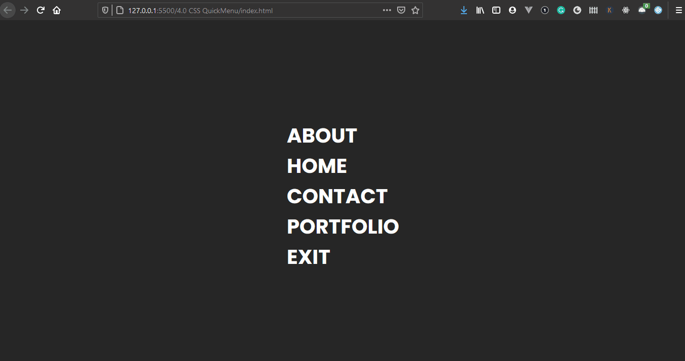

### Day 3

Today I've created a fancy looking menubar that resides at the center of the webpage and using CSS pseduo-property 
`::before` for the animation.

**Here is the LIVE example of the menu**
