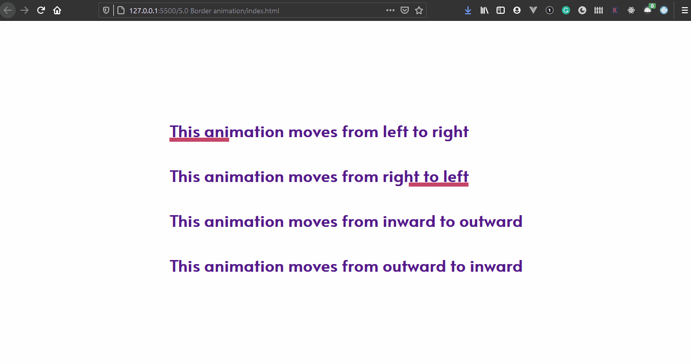

### Day 3

This is the usage of CSS pseudo elements `::before` and `::after` to demonstrate different underline effects.
The different effects demonstrated are:
1) Animation from left to right
1) Animation from right to left
1) Animation from inward to outward
1) Animation from outward to inward

**Here is the LIVE example of the menu**
