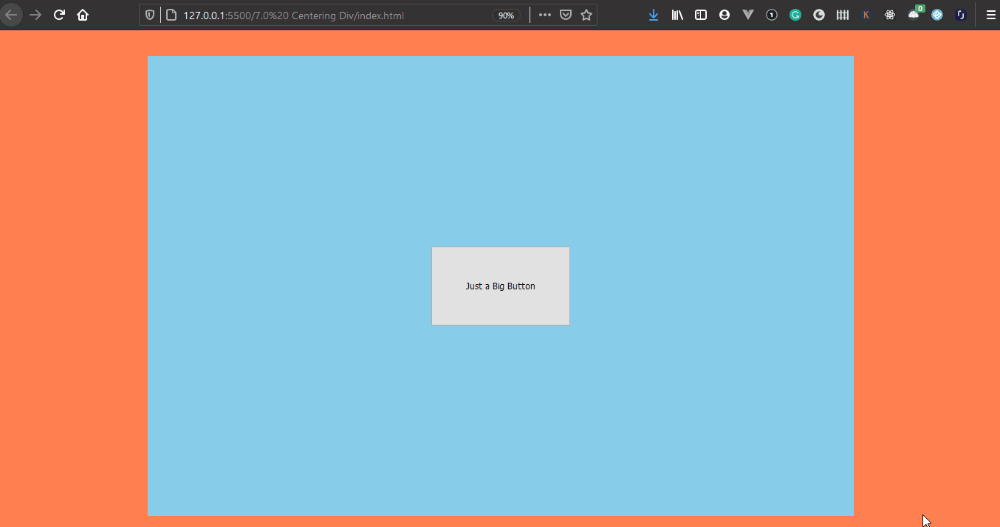

### Day 5

Here I learnt a new way  of centering a child element using `place-items:center`. You just have to `display:grid` and `place-items:center` on the parent element and the child element will be centered.

**Here is the LIVE example of the menu**
